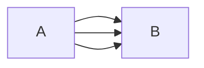

## Trajektorienplanung

Pfad von A nach B ist eine kontinuierliche Abbildung: $y \to Q$ Konfigurationsraum eines Roboters

Eine Trajektorie ist eine Zeitfunktion $\mathbf{y}(t)$ mit $y(0) = y_0$ und $y(t_f) = y_f$

$T = t_f - t_s$ Zeit um Trajektorie abzufahren

### Nebenbedingungen

$$ \begin{align} \dot{y}(t_f)=0, \quad \dot{y}(t_s) = 0, \quad \ddot{y}(t_f) =0 \end{align} $$

### Polynom 3. Ordun um Verlauf über Parameter zu beschreiben

$$ y(t) = a_0 + a_1 t + a_2 t^2 + a_3 t^3 $$

Somit

$$ \begin{align} y_0 &= a_0 + a_1 t_0 + a_2 t_0^2 + a_3 t_0^3 \\
                y_f &= a_0 + a_1 t_f + a_2 t_f^2 + a_3 t_f^3 \end{align} $$

Und 
$$\dot{y}(t) = a_1 + 2 a_2 t + 3 a_3 t^2$$

$$ \begin{align} v_0 &= a_1 + 2 a_2 t_0 + 3 a_3 t_0^2 \\ v_f &= a_1 + 2 a_2 t_f + 3 a_3 t_f^2 \end{align} $$

In Matrizenschreibweise:

$$ \begin{align} \underbrace{\begin{pmatrix} 1&t_0&t_0^2&t_0^3 \\ 0&1&2t_0&3 t_0^2\\ 1&t_f&t_f^2& t_f^3\\ 0&1&2t_f&3 t_f^2 \end{pmatrix} }_{\mathbf{A}} \underbrace{\begin{pmatrix} a_0 \\ a_1 \\ a_2 \\ a_3 \end{pmatrix} }_{x} = \underbrace{\begin{pmatrix} y_0 \\ v_0 \\ y_f \\ v_f \end{pmatrix} }_{\mathbf{b}}\end{align} $$

Eindeutig lösbar wenn $\det(A) \neq 0$ wir also nicht unendlich schnell sein wollen.

## Regelung starer Mehrkörpersysteme

$$ \begin{align} M(y,t) \cdot \ddot{y} + k(y,\dot{y},t) = f_{ally}(y,\dot{y}, t) + B(y) \cdot u \end{align} $$

End-Effektor Position
$$p^{EF} = p^{EF}(y)$$

Sollbahn
$$p_D^{EF}$$
2 mal stetig differenzierbar

System ist voll aktuiert
$y, u, p^{EF} \in \mathbb{R}^f$

## 2.1 Inverse Kinematik

$$p_d^{EF}(yd) = p d^{EF} \to yd = p^{EF^{-1}}(p d^{EF})$$

### 2.2 Vorsteuerung, Feedforward Control

### 2.3 Rückführender Regler (Feedback Control)

